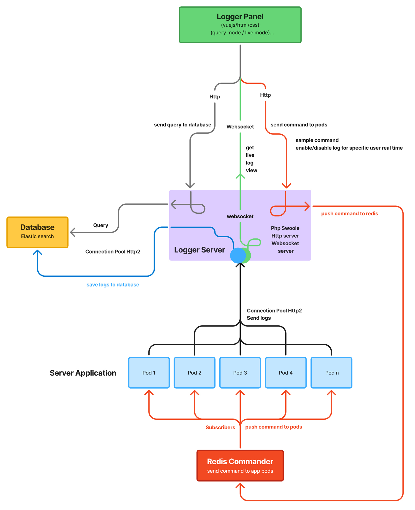

<div align="center">
   

# Light Logger

A high-performance, distributed logging system built with PHP Swoole. Designed for microservices architectures with real-time log streaming, centralized storage, and dynamic log control.

</div>


<p align="center">
  
</p>

> **Note:** This project is under active development. Features and APIs may change.

## Features

- **High Performance** - Built on PHP Swoole with coroutine support for non-blocking I/O
- **HTTP/2 Support** - Efficient log ingestion from application pods via HTTP/2 connection pooling
- **Real-time Streaming** - WebSocket-based live log viewing for dashboards
- **Dynamic Log Control** - Enable/disable logging for specific users in real-time via Redis pub/sub
- **Kubernetes Ready** - Health check endpoints and scalable architecture

## Architecture

Light Logger consists of the following components:

| Component | Description |
|-----------|-------------|
| **Logger Server** | PHP Swoole-based HTTP & WebSocket server (core) |
| **Logger Panel** | Vue.js dashboard for querying and live log viewing |
| **Elasticsearch** | Log storage and search engine |
| **Redis** | Command distribution to application pods |

### Data Flow

1. **Log Ingestion**: Application pods send logs via HTTP/2 to Logger Server
2. **Querying**: Panel queries logs via HTTP from Logger Server
3. **Live Streaming**: Panel receives real-time logs via WebSocket
4. **Commands**: Dynamic commands (e.g., enable user logging) flow through Redis to pods

## Requirements

- PHP 8.3+
- Swoole extension 6.0+
- Redis 7.x
- MariaDB 11+
- Node.js 20+ (for panel development)
- Docker & Docker Compose (recommended)

## Quick Start with Docker

### Production Mode (Recommended for deployment)

```bash
# Build and start all services
docker-compose build
docker-compose up -d

# Access the application
# Backend API & Panel: http://localhost:9501
```

**Features:**
- Automatic panel build (no manual npm commands needed)
- Multi-stage Docker build with optimized image size
- All dependencies bundled in the image

### Development Mode (Recommended for active development)

```bash
# Build and start development services
docker-compose -f docker-compose.dev.yml build
docker-compose -f docker-compose.dev.yml up -d

# Access points:
# - Backend API: http://localhost:9501
# - Frontend (Vite dev server with hot reload): http://localhost:3000
```

**Features:**
- Hot reload for both frontend and backend
- Live code changes without rebuilding
- Vite dev server for instant panel updates
- Source code mounted as volumes

### Included Services

All services are automatically configured:
- **Logger Server** (PHP/Swoole) - Port 9501
- **Panel Dev Server** (Vite) - Port 3000 (dev mode only)
- **MariaDB** - Port 3306
- **Redis** - Port 6379

### View Logs

```bash
# Production mode
docker-compose logs -f app

# Development mode
docker-compose -f docker-compose.dev.yml logs -f app
docker-compose -f docker-compose.dev.yml logs -f panel-dev
```

### Stop Services

```bash
# Production mode
docker-compose down

# Development mode
docker-compose -f docker-compose.dev.yml down
```

## Manual Installation (Without Docker)

If you prefer to run without Docker:

1. Install PHP 8.3+ with Swoole extension
2. Install Redis and MariaDB
3. Install Node.js 20+
4. Install PHP dependencies: `cd server && composer install`
5. Install panel dependencies: `cd panel && npm install`
6. Build the panel: `npm run build`
7. Configure environment variables
8. Start the server: `php server/start.php`

## Troubleshooting

**"Cannot find module @rollup/rollup-linux-x64-musl"**
- This is resolved in the dev configuration by using node:20-slim image with proper volume mounts

**"Changes not reflecting in development"**
- Make sure you're accessing http://localhost:3000 for the panel (not 9501)
- The vite.config.js has polling enabled for Docker file watching

**"Panel not loading"**
- Production mode: Rebuild the image to build the panel
- Development mode: Container automatically installs dependencies on startup

## Contributing

Contributions are welcome! Please read our [Contributing Guide](CONTRIBUTING.md) before submitting a Pull Request.

## License

This project is licensed under the MIT License - see the [LICENSE](LICENSE) file for details.

## Author

**Morteza Moradi** - [moradiemails@gmail.com](mailto:moradiemails@gmail.com)

## Acknowledgments

- [Swoole](https://www.swoole.com/) - High-performance coroutine-based PHP framework
- [Vue.js](https://vuejs.org/) - Progressive JavaScript framework
